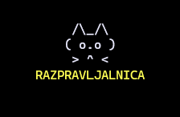
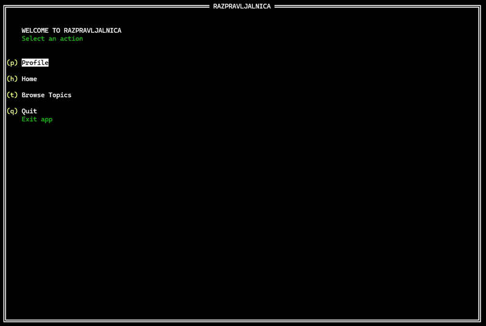

# Razpravljalnica



[](https://pkg.go.dev/github.com/rivo/tview)

**Razpravljalnica** is a distributed discussion service built in **Go**, designed to demonstrate **Chain Replication** and real-time communication using **gRPC**.

Users can:
- create a new user (password logic not implemented),
- create new discussion topics,
- post messages inside topics,
- like messages (with like counts stored),
- subscribe to one or more topics and receive real-time notifications about new events.

The application provides **two client interfaces**:
- a classic **CMD client**,
- an interactive **terminal UI** built with **tview**.

---

## Supported Client Operations

| Command | Description | Executed On |
|------|-------------|-------------|
| `1 - Create User` | Create a new user | HEAD |
| `2 - Create Topic` | Create a new topic | HEAD |
| `3 - List Topics` | Display all topics | TAIL |
| `4 - Post Message` | Post a message to a topic | HEAD |
| `5 - Get Messages` | Read messages from a topic | TAIL |
| `6 - Like Message` | Like a message | HEAD |
| `7 - Subscribe to Topics` | Subscribe to events in selected topics | Assigned node (load-balanced) |
| `8 - Get Cluster State` | Display cluster state (HEAD, TAIL, chain) | HEAD |
| `9 - Demo Mode` | Automatically runs test operations (users, topics, messages, likes) | HEAD / TAIL |

---

## Example Usage

Example setup with **three nodes**.

### Terminal 1 – HEAD
```bash
go run *.go -role head -p 9876 -successor localhost:9877 -all localhost:9876,localhost:9877,localhost:9878
```

### Terminal 2 – INTERMEDIATE
```bash
go run *.go -role intermediate -p 9877 -successor localhost:9878 -all localhost:9876,localhost:9877,localhost:9878
```

### Terminal 3 – TAIL
```bash
go run *.go -role tail -p 9878 -all localhost:9876,localhost:9877,localhost:9878
```

### Terminal 4 – Client

```bash
# CMD client
go run *.go -head localhost:9876 -tail localhost:9878

# TVIEW client
go run ui/main.go -head localhost:9876 -tail localhost:9878

# Test mode
go run *.go -head localhost:9876 -tail localhost:9878 -test
```

> On **Windows**, replace `*.go` with explicit file names  
> (e.g. `main.go server.go ...`).

---

## User Interface

The application supports two UI modes.

### TVIEW UI
Interactive terminal UI built with https://pkg.go.dev/github.com/rivo/tview



Run:
```bash
go run ui/main.go -head localhost:9876 -tail localhost:9878
```

Features:
- keyboard navigation,
- dynamic data refresh,
- subscribed topics overview,
- real-time news feed.

### CMD UI
Classic command-line usage with all output printed directly to the terminal.

Run:
```bash
go run *.go -head localhost:9876 -tail localhost:9878
```

---

## Architecture

The system is based on **Chain Replication**:

- **HEAD**  
  Handles all write operations:
  - user creation,
  - topic creation,
  - message posting,
  - liking messages.

- **INTERMEDIATE nodes**  
  Forward and replicate write operations from HEAD toward TAIL.

- **TAIL**  
  Handles all read operations:
  - listing topics,
  - reading messages.

The client:
- writes via **HEAD**,
- reads via **TAIL**,
- can subscribe to topics and receive **real-time push events** via gRPC.

The entire system is implemented in **Go**, with **gRPC** used for both client–server and internal server communication.
